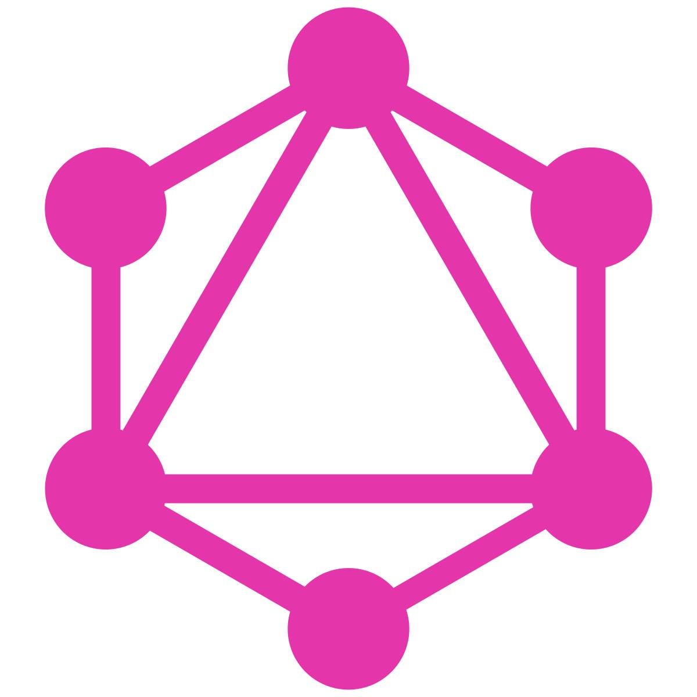
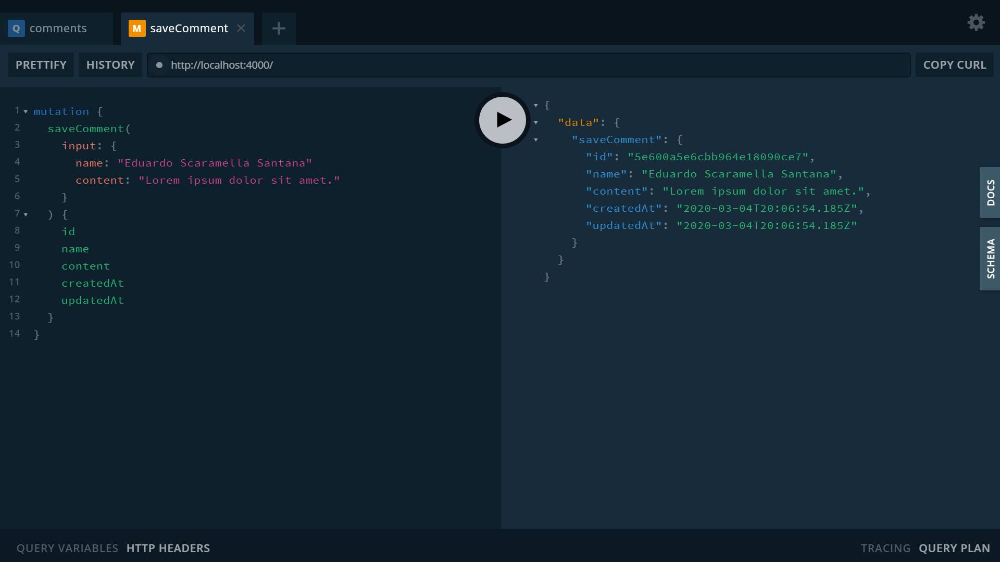
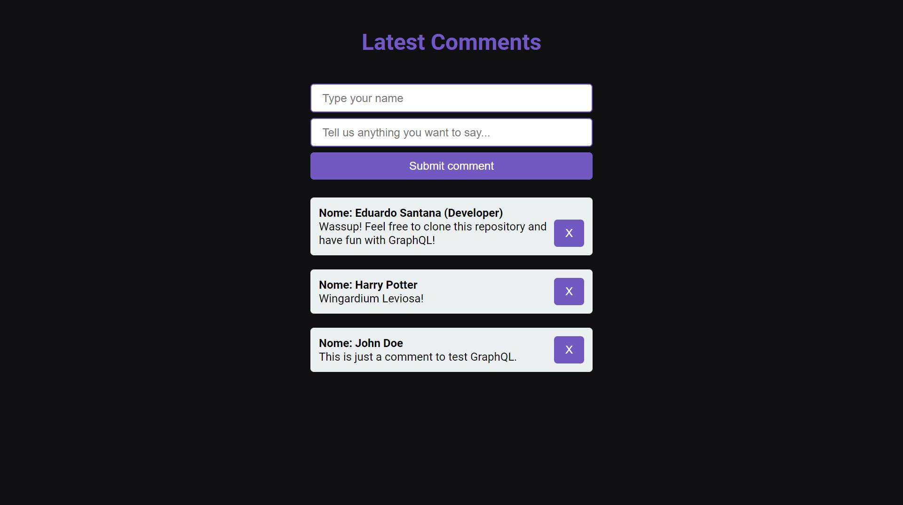

<p align="center">
  
</p>

<h3 align="center">
  Simple comments timeline with GraphQL
</h3>

<p align="center">This repository contains a simple comments timeline to study a little bit of GraphQL.</p>

## Features
The main features are detailed below:

1. Comments list
2. Create comments
3. Delete comments

## Technologies
Now let's take a look at the technologies used to develop the features mentioned above.

### Back-End

- GraphQL
- Apollo Server
- Docker
- MongoDB
- NPM / Yarn as package managers

### Front-End

- ReactJS
- GraphQL
- Apollo React Hooks
 

## Setup
After cloning the repository, it is mandatory to install all the dependencies this software needs. You can choose your favorite package manager: Yarn or NPM.
If you're a yarn user:
```bash
yarn install
```
However, if NPM fits better for you just run the command:
```bash
npm install
```

<br />

To finish the setup, create a copy of `.env.example` file and rename it to `.env`. Choose a connection 
string the `MONGO_URL` environment variable.
<br />
I strongly recommend using Docker to place your MongoDB database into a container.


## Running the app

### Back-End

First of all you need to keep the back-end alive. From the root directory, access the server-side folder running the command
`cd server`. Once you're on the correct path, run the back-end on <b>port 4000</b>:
```bash
yarn dev
```

If you want to test your back-end, simply access `http://localhost:4000` on your browser and use the <b>Apollo Server Playground</b>,
which is a tool provided by Apollo Server to send requests to your GraphQL API. Here we have an example:

<p align="center">
  
</p>

### Front-End

Now move yourself to the front-end directory, running the command `cd client`. Then start your ReactJS app on <b>port 3000</b>:
```bash
yarn start
```
If you made this far, a new tab will be opened on your default browser. Below there's a preview of the ReactJS app ⚛

<p align="center">
  
</p>
